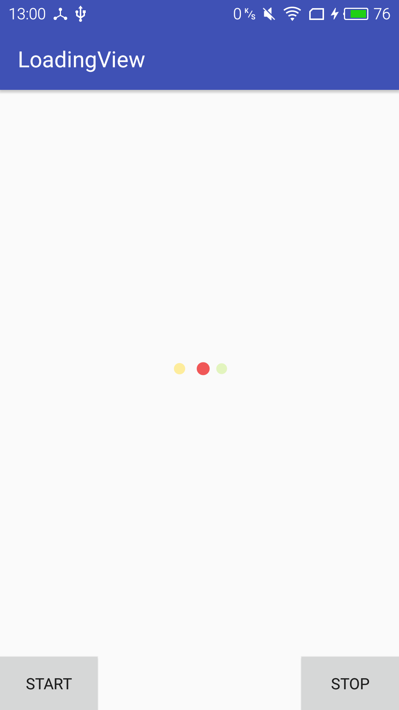

# LoadingView

# useage

## gradle

**Step 1.** Add the JitPack repository to your build file

Add it in your root build.gradle at the end of repositories:

```
	allprojects {
		repositories {
			...
			maven { url "https://jitpack.io" }
		}
	}
```

**Step 2.** Add the dependency

```
	dependencies {
	        compile 'com.github.duanjunxiao:LoadingView:v0.0.0'
	}
```


## Just to use like this

```
   public void showLoading() {
        showLoading(true);
    }

    public void showLoading(boolean cancelable) {
        if (isFinishing()) {
            return;
        }
        if (loadingDialog == null) {
            loadingDialog = new LoadingDialog(this);
            loadingDialog.setCanceledOnTouchOutside(cancelable);
            loadingDialog.setCancelable(cancelable);
            loadingDialog.show();
        } else {
            if (!loadingDialog.isShowing()) {
                loadingDialog.show();
            }
        }
    }

    public void hideLoading() {
        if (loadingDialog != null && loadingDialog.isShowing()) {
            loadingDialog.dismiss();
            loadingDialog = null;
        }
    }
```
